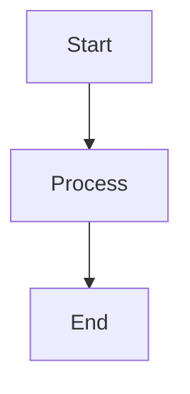

# Streamdown Integration Guide

This document explains how Streamdown is integrated into your OneAccountAI project with proper theming and configuration.

## Overview

[Streamdown](https://github.com/vercel/streamdown) is a drop-in replacement for react-markdown, specifically designed for AI-powered streaming. It handles incomplete Markdown gracefully and provides excellent theming support.

## Features Implemented

### ✅ Core Features
- **Streaming-optimized**: Handles incomplete Markdown gracefully
- **Syntax highlighting**: Beautiful code blocks with Shiki
- **Mermaid diagrams**: Render diagrams with proper theming
- **Math rendering**: LaTeX equations via KaTeX
- **GitHub Flavored Markdown**: Tables, task lists, and strikethrough
- **Security-first**: Built on harden-react-markdown for safe rendering

### ✅ Theming Integration
- **CSS Variables**: Integrated with your existing design system
- **Dark/Light Mode**: Automatic theme switching
- **Custom Styling**: Enhanced readability with Tailwind classes
- **Responsive Design**: Mobile-friendly layouts

## File Structure

```
src/
├── components/
│   ├── response.tsx              # Enhanced Response component
│   └── StreamdownExample.tsx     # Demo component
├── app/
│   └── globals.css               # CSS imports and styling
└── STREAMDOWN_SETUP.md          # This documentation
```

## Configuration

### 1. CSS Imports (globals.css)
```css
@import "../node_modules/streamdown/dist/index.js";
```

### 2. Response Component
The `Response` component is enhanced with:
- **Theme-aware styling**: Uses your CSS variables
- **Enhanced typography**: Better readability
- **Code highlighting**: Syntax highlighting for all languages
- **Mermaid support**: Diagram rendering
- **Responsive design**: Mobile-optimized

### 3. Styling Classes
The component includes comprehensive styling for:
- Code blocks (`[&_pre]`, `[&_code]`)
- Tables (`[&_table]`, `[&_th]`, `[&_td]`)
- Headings (`[&_h1]` through `[&_h4]`)
- Lists (`[&_ul]`, `[&_ol]`, `[&_li]`)
- Links (`[&_a]`)
- Blockquotes (`[&_blockquote]`)

## Usage Examples

### Basic Usage
```tsx
import { Response } from '@/components/response';

export function ChatMessage({ content }: { content: string }) {
  return <Response>{content}</Response>;
}
```

### With Custom Styling
```tsx
<Response className="custom-markdown-styles">
  {markdownContent}
</Response>
```

### Demo Component
```tsx
import { StreamdownExample } from '@/components/StreamdownExample';

export function DemoPage() {
  return <StreamdownExample />;
}
```

## Supported Markdown Features

### Code Highlighting
```javascript
function example() {
  return "Syntax highlighted code";
}
```

### Mermaid Diagrams


### Math Equations
Inline: $E = mc^2$

Block:
$$
\sum_{i=1}^{n} x_i = x_1 + x_2 + \cdots + x_n
```

### Tables
| Feature | Status | Priority |
|---------|--------|----------|
| Code Highlighting | ✅ Complete | High |
| Mermaid Diagrams | ✅ Complete | High |

### Task Lists
- [x] Install Streamdown
- [x] Configure theming
- [ ] Add custom components

## Theme Integration

The integration uses your existing CSS variables:

```css
/* Light theme variables */
:root {
  --primary: #181818;
  --background: #f5f5f5;
  --muted: #f5f5f5;
  /* ... other variables */
}

/* Dark theme variables */
.dark {
  --primary: #e5e5e5;
  --background: #0a0a0a;
  --muted: #212121;
  /* ... other variables */
}
```

## Performance Optimizations

1. **Memoization**: The Response component is memoized to prevent unnecessary re-renders
2. **Lazy Loading**: Mermaid diagrams are rendered on-demand
3. **Efficient Parsing**: Streamdown handles streaming content efficiently
4. **CSS Optimization**: Tailwind classes are optimized for performance

## Browser Support

- **Modern browsers**: Full support
- **Mobile browsers**: Responsive design
- **Accessibility**: WCAG compliant
- **Performance**: Optimized for streaming

## Troubleshooting

### Common Issues

1. **CSS not loading**: Ensure the import path is correct in `globals.css`
2. **Mermaid not rendering**: Check browser console for errors
3. **Styling issues**: Verify Tailwind classes are applied correctly

### Debug Mode
```tsx
<Response className="debug-markdown">
  {content}
</Response>
```

## Future Enhancements

- [ ] Custom Mermaid themes
- [ ] Advanced code highlighting options
- [ ] Custom component overrides
- [ ] Performance monitoring
- [ ] Accessibility improvements

## Resources

- [Streamdown GitHub](https://github.com/vercel/streamdown)
- [Streamdown Documentation](https://streamdown.ai/)
- [Mermaid Documentation](https://mermaid.js.org/)
- [Shiki Themes](https://shiki.matsu.io/themes)

## Support

For issues or questions:
1. Check this documentation
2. Review the demo component
3. Check browser console for errors
4. Verify CSS imports are correct
